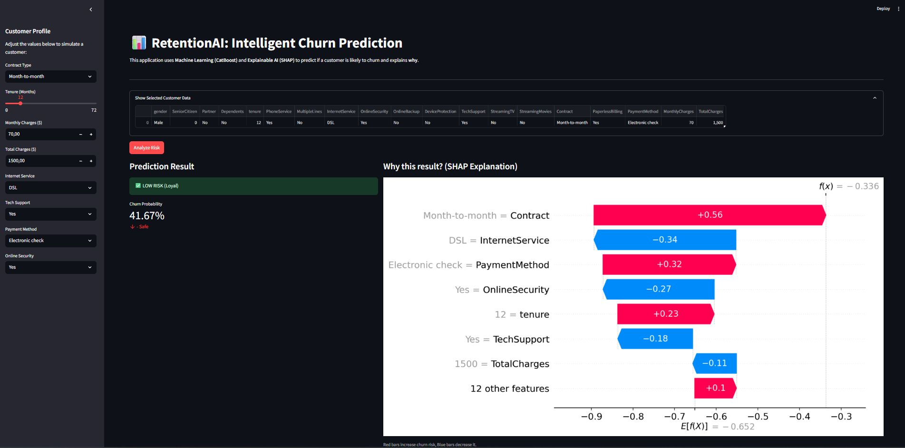
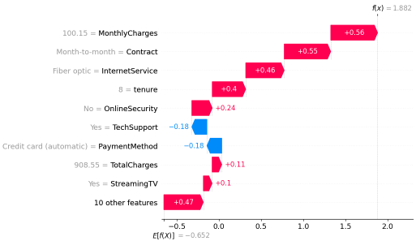
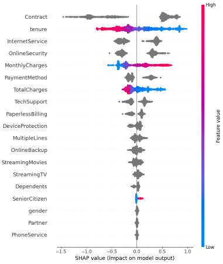

# RetentionAI: Customer Churn Prediction & Explainability

<p align="center">
  
  
  
  
</p>

## Project Overview
**RetentionAI** is an end-to-end Machine Learning application designed to predict customer churn in the telecommunications industry. Unlike traditional black-box models, this project prioritizes **Explainable AI (XAI)** to provide actionable insights into *why* a customer is at risk.

The application allows business users to input customer data interactively and receive:
1.  **Real-time Risk Score:** The probability of the customer leaving.
2.  **SHAP Explanation:** A visual breakdown of key drivers (e.g., *Month-to-month contract* increases risk, while *Long tenure* decreases it).

## Visuals & Analysis

### 1. Interactive Dashboard (Streamlit)
Real-time risk analysis interface for marketing teams.

<p align="center">
  
</p>

### 2. Local Explanation (SHAP Waterfall)
Mathematical proof of **why** a specific customer is predicted to churn.
*(Red bars indicate factors increasing risk; Blue bars indicate factors decreasing risk.)*

<p align="center">
  
</p>

### 3. Global Risk Factors (SHAP Summary)
Analysis of the most important drivers of churn across the entire customer base.
*(High values of 'Monthly Charges' and 'Month-to-month Contract' are strong indicators of churn.)*

<p align="center">
  
</p>

## Business Problem
Acquiring a new customer is **5-25x more expensive** than retaining an existing one. The goal of this project is to:
* Identify high-risk customers **before** they churn.
* Minimize False Negatives (missing a churner) to save revenue.
* Provide interpretability for marketing teams to design targeted retention campaigns.

## Tech Stack & Methodology
* **Data Processing:** Pandas, NumPy (Handling Imbalanced Data).
* **Modeling:** **CatBoost Classifier**.
    * *Why CatBoost?* Chosen for its superior performance with categorical features and robustness on tabular data without extensive preprocessing (like One-Hot Encoding).
* **Optimization:** **Threshold Moving**.
    * Optimized decision threshold: **0.56** (vs default 0.50).
    * Result: Maximized **F1-Score (0.64)** to balance Precision and Recall.
* **Explainability:** **SHAP (SHapley Additive exPlanations)** for local and global feature importance.
* **Deployment:** **Streamlit** for the web interface.

## Model Performance
Evaluated on a held-out test set with a heavy class imbalance (26% Churn rate):

| Metric | Score | Note |
| :--- | :--- | :--- |
| **Recall (Churn)** | **75%** | Correctly identified 75% of actual churners. |
| **Precision** | 56% | Balanced to avoid excessive false alarms. |
| **F1-Score** | **0.64** | Key metric for imbalanced classification. |
| **Accuracy** | 79% | Overall correctness. |

## Installation & Usage

To run this project locally:

1.  **Clone the repository:**
    ```bash
    git clone [https://github.com/sevvallaydogann/RetentionAI.git](https://github.com/YOUR_USERNAME/RetentionAI.git)
    cd RetentionAI
    ```

2.  **Install dependencies:**
    ```bash
    pip install -r requirements.txt
    ```

3.  **Run the application:**
    ```bash
    streamlit run app.py
    ```

## Project Structure
```text
RetentionAI/
├── app.py               # Streamlit Application (Main)
├── churn_model.cbm      # Trained CatBoost Model
├── requirements.txt     # Python Dependencies
├── notebooks/           # Training & EDA Notebooks
├── data/                # Dataset (Telco Customer Churn)
├── images/              # Project Screenshots
│   ├── demo_screenshot.png
│   ├── shap_waterfall.png
│   └── shap_summary.png
└── README.md            # Project Documentation
